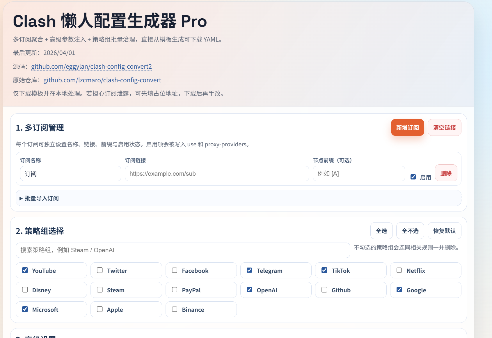

# clash-config-convert2

一个纯前端的 Clash/Mihomo 懒人配置生成器：读取本地 `template.yaml`，在浏览器内完成参数注入、策略组裁剪和 YAML 导出。支持多订阅聚合、高级参数注入和策略组批量管理。您可以直接通过网页端将订阅链接转换为可直接导入的 YAML 配置文件。



## 功能特点

- **多订阅聚合**：支持添加多个机场订阅链接，支持直接配置前缀，并统一整合到一个配置文件中。
- **策略组批量管理**：提供可视化的界面选择保留或删除特定的策略组（如 OpenAI、Steam 等地区或服务节点策略），未勾选的策略组连带相关规则会被自动清理。
- **高级参数调整**：支持自定义订阅更新间隔、测速间隔等高级参数，可修改输出配置文件名。
- **保护隐私**：纯前端实现，所有的处理过程都在本地浏览器即可完成，可以直接使用下载生成的配置文件，不用担心订阅链接被上传或泄露。
- **开箱即用**：自带基于 [clash-config-convert](https://github.com/lzcmaro/clash-config-convert) 和 `liuran001` 的优化模板。

## 如何使用

### 1. 本地测试运行

本项目可以使用任何 HTTP Server 运行，也可以使用内置的 Python 脚本快速启动测试：

```bash
# 确保你安装了 Python 3.11+
python server.py
```

终端会输出：
```
HTTP server is running at http://localhost:7799/
```
打开浏览器访问即可。

### 2. 静态部署使用

因为项目由纯前端和静态文件组成，可以直接托管在 GitHub Pages、Vercel、Cloudflare Pages 等静态网站托管服务。

## 文件说明

- `index.html`: 前端主页面，包含所有样式和逻辑。
- `template.yaml`: Clash / Mihomo 配置的基础模板。
- `server.py`: 一个简单的本地 Python HTTP 服务器。

## 鸣谢

- 本项目为 [lzcmaro/clash-config-convert](https://github.com/lzcmaro/clash-config-convert) 的二次开发改进版本。
- 感谢 clash 懒人配置：[liuran001](https://gist.github.com/liuran001/5ca84f7def53c70b554d3f765ff86a33)。

## 友情链接

- [LINUX DO - 新的理想型社区](https://linux.do/)

